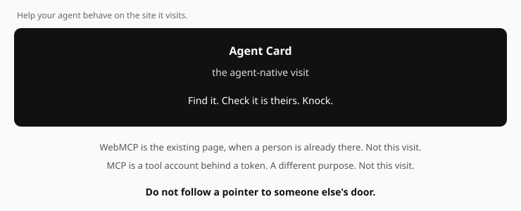

# Agent Web Router

[](https://www.npmjs.com/package/@muretai/agent-web-router)
[](LICENSE)

**Help your agent behave on the websites it visits.**

It finds the door that site published, checks it is really theirs, and knocks.
It does not scrape the page, and it does not follow a pointer to someone
else's door.

## Contents

- [What this is](#what-this-is)
- [Try it](#try-it)
- [Probe](#probe)
- [Knock](#knock)
- [Handoff](#handoff)
- [Conduct](#conduct)
- [Library](#library)
- [Any A2A door](#any-a2a-door-not-one-vendor)

## What this is

A site may have published an Agent Card (any A2A door, not one vendor), an MCP
server, or WebMCP tools in the page. Those are different jobs, often named
together. This package reads what is there, checks it belongs to the origin you
dialled, and takes the one that fits what you hold — a key, a token, a person
in the tab, a browser. If there is nothing to take, it says why and exits 2.

Opening the page first is how an agent follows a rewritten address — carrying
*your* signed identity — to someone else's door. If nobody is in the tab and
the site prepared a card or an MCP server, take that. Do not scrape the page
just because WebMCP exists.

| | |
|---|---|
| **Who installs this** | People whose *agent* visits sites it did not build — harness authors, IDE agents, a crawler that should knock instead of scrape. |
| **Not for** | Website owners putting up a door or putting tools in the page. This package does not run on the site. |
| **The problem** | A scrape is a bad visit. Opening the page first can take the agent's signed identity to someone else's door. |

The comparison is not Card vs MCP vs WebMCP. Those are different jobs a site
may have published, and a site that prepared all three should keep all three.
The comparison is a scrape — a badly behaved visit — against using what the
site published:



| published | job | you need | what remains |
|---|---|---|---|
| **card** — the Agent Card and the A2A door it names | an agent-native visit | the agent's own key, a `did:key` | a counterparty the site can reach again |
| **page** — WebMCP tools in the page | the existing page | a person in the tab | nothing; it closes with the tab |
| **mcp** — an MCP server the site declares | a tool account | a token | an account on that server |

Which published job to take depends on **what the visit is**, and that is the
decision this tool makes:

- **a person is in the tab** → WebMCP (the page). It is theirs; its tools run in their session.
- **the agent is alone** → the Agent Card first (its key is all it needs), the MCP server if
  it holds a token. WebMCP only if it carries a browser of its own — and robots.txt may
  still refuse a headless visit to the page.

The router does four things and nothing else: **probe** an origin (GET only — it never runs
page script, never opens a browser), **route** by what is on hand, **check a handoff** — a tool
result that says "the rest of this happens at the card / on this page / on this server" —
against the site's own card, and **knock**: POST one signed A2A `message/send` at the URL the
card names, with a key the agent already holds, and verify the signed reply. It does not
browse, scrape, or mint keys: when the page is the way in, it hands the page to the browser
your harness already has.

Zero dependencies. Node ≥ 20. MIT. Status: **0.5.0** — `npm i @muretai/agent-web-router`, or run it directly: `npx @muretai/agent-web-router probe <url>`.

## Try it

```
node bin/agent-web-router.mjs probe https://shop.example
node bin/agent-web-router.mjs probe https://shop.example --person      # a person is in the tab
node bin/agent-web-router.mjs probe https://shop.example --browser     # you can run one headless
node bin/agent-web-router.mjs probe https://shop.example --token       # you hold an MCP credential
node bin/agent-web-router.mjs probe https://shop.example --no-key      # you hold no signing key yet
node bin/agent-web-router.mjs probe https://shop.example --json
```

A probe reads the origin you name with GET only: the Agent Card at
`/.well-known/agent-card.json` (falling back to the legacy `/.well-known/agent.json`) and its
signature at `/.well-known/agent-card.sig.json` (plus the card's A2A `additionalInterfaces`,
extension URIs, `domains`, and whether `/.well-known/did-configuration.json` **proves** the
card's DID for this origin — the Domain Linkage Credential is verified: signature under the
DID's own key over the JWS text, origin match, and a mandatory `exp`, each failure named);
the MCP server card at `/.well-known/mcp.json`
(SEP-2127, a draft at the time of writing); and the front page's HTML, from which it lists the
**declarative** WebMCP tools (`<form toolname=… tooldescription=…>`) and reports a hint when
the **imperative** API (`document.modelContext`) is referenced — the imperative tool list is
only observable by running the page, so the probe never claims it.

Output, for a site that published a card and a couple of declarative tools:

```
agent-web-router 0.5.0 · https://shop.example

ways in
  card   did:key:z6MkExample…
         signed: yes  door: https://shop.example/  skills: 1
  mcp    not declared (404)
  page   2 declarative tool(s) (book_table, hours); imperative hint: modelContext referenced in the page

on hand: key yes  token no  browser no  person no

route  (order: default)
  1. card  the door answers one signed message; your key is all it needs

excluded
  mcp   no MCP server card (/.well-known/mcp.json answered 404)
  page  the page has tools but you carry no browser; 2 declarative form(s) name an action and could be submitted as plain HTTP

knock: POST https://shop.example/  to did:key:z6MkExample…  sign contextId,from,messageId,text,timestamp,to  how-to https://shop.example/how-to
```

Every way appears in exactly one of `route` and `excluded`, so "why not X" is always
answered. Exit status is 0 when there is something to take and 2 when there is not.

**Signposts.** Sites describe themselves to agents in many competing ways — `robots.txt`
(per AI-crawler verdicts and `Content-Signal`), `llms.txt` and `llms-full.txt`, a Markdown
edition on `Accept: text/markdown`, JSON-LD `@type`s, a `Link` header pointing at the card,
VOIX `<tool>` elements beside WebMCP forms. The probe reads the ones sites actually deploy
and reports them
in one `signposts` block so a visitor sees the whole of what the site put up without knowing
every convention. None of them is a way in, so none of them creates a route.

**The skill.** [`SKILL.md`](SKILL.md) is the same procedure written for an agent to follow by
hand — the GETs, the checks, the refusals — for a harness that cannot run Node. The command
line is the version that cannot get the refusals wrong. Distilling those refusals from
probe/knock traces, without letting prose override the interceptor, is
[`spec/skill-distill.md`](spec/skill-distill.md). On this machine only:
`npm run distill` labels the fixtures with `route` / `checkHandoff`, writes
`generated/rules.json`, and measures whether the rules beat first-match.
`npx @muretai/agent-web-router probe <url> --json | npm run distill:record`
appends *your* probe to `var/traces.jsonl`. Nothing is uploaded.

## Probe

### The rules a probe enforces

These are the checks that make the `card` route safe to take. Each is tested by actually
attempting the attack in `test/`.

- **The card must be served by the origin you dialled.** A redirect to another host is a
  substitution, not a card.
- **The card's `url` must name the origin you dialled**, or the door it points at is not this
  site's — the route is excluded.
- **A signature that is present and fails is a refusal, never "unsigned".** A card that
  fails its own signature is exactly what a substituted card looks like. An *absent*
  signature is allowed through with a note: the door's signed reply is what proves the key.
- **The MCP server card binds only its own origin.** An endpoint on another origin — or a
  server card served from one — is excluded, exactly as a card is: `/.well-known/mcp.json`
  is the origin's statement about itself, and an endpoint elsewhere carries no DID a reply
  could ever be verified under.
- **A probe is GET only.** Nothing here POSTs; the test suite asserts it.
- **A probe is bounded.** Bodies are abandoned at the byte cap (never read to the end), and
  every request shares one wall-clock deadline (default 30 s, `--deadline`) — a black-holing
  origin cannot hold a probe, and what was not attempted is said in `notes`.
- **robots.txt is honoured for a headless visit.** If the `*` group disallows the front page,
  the page is not a route for an agent alone — a headless visit is a crawl. A person in the
  tab is not a crawler, so their page route is untouched. The door is for agents and is not
  closed by robots.txt.

### The site designs the order

The order above is only the router's **default**. Which way a visitor should take first is
the site's design: whether a keyless agent should read on the page and become a counterparty
later, or knock first, is something only the site knows. The site says it in its card —
the origin's own statement, signed when the site signs it — not in the page, which any
script it loads can rewrite:

```json
{ "agentEntry": { "open_door": true,
                  "prefer": [ { "kind": "page", "when": "no-key" }, "card", "mcp" ] } }
```

An entry is a kind (`page`, `card`, `mcp`) or `{ "kind", "when" }`, with `when` one of
`person`, `alone`, `key`, `no-key`, `token`, `browser`, read against what the visitor has on
hand. The router puts the declared entries whose condition holds first, in the declared
order, then its own order for the rest; the output says `order: the site's`.

Two things a declaration cannot do: **add a route the rules exclude** (no page without a
person or a browser, no server without a token, no door that failed its signature — it only
re-orders what is on offer), and **come from a card that failed its own signature** (an
excluded card declares nothing). The rest of the path — "you read, now let's make it a
relationship" — is the site's to design too, with a handoff.

## Knock

```
node bin/agent-web-router.mjs knock https://shop.example --key ./visitor.key --text "Do you have tables tonight?"
node bin/agent-web-router.mjs knock https://shop.example                     # no key: prints the door's own how-to, sends nothing
```

`knock` completes the card route: it probes, and only if the door survived every refusal
above does it POST one A2A `message/send` — the six fields `contextId, from, messageId,
text, timestamp, to` canonicalised and signed with Ed25519 — to the endpoint the card names,
on the origin you dialled. The reply is verified before it is shown: signed by **the DID the
card names** (never the reply's own `from`), addressed to you, within 300 s. A reply that
fails any of those is printed with the reason and exit 2; a door's refusal (a JSON-RPC error)
is printed as what it is — an answer that teaches — with its how-to.

**A refusal is final for the call.** `knock` makes exactly one POST. A 429 or 503, or a
JSON-RPC error such as the door's own over-rate `-32004`, comes back to you with its
`Retry-After` as `retryAfter` (seconds) and is never retried: re-sending the same signed
message is a replay, and re-sending a fresh one inside the window is what the door just asked
you not to do. Whether to come back later is yours to decide, with the door's own number in hand.

`--key` is a key you already hold: the muretai key file (`{"seed": "<64 hex>", …}`) or a bare
64-hex seed. **Nothing here mints a key.** Where a key comes from and where it lives — per
visit, per machine, per site — decides whether the site sees one returning visitor or a
stranger every time, and that is the agent's decision. Without a key, `knock` sends nothing
and prints the door's own instructions for making one.

To continue a conversation, pass the `contextId` a verified reply carried back on your next
knock with `--context <id>` — it is one of the six signed fields, so the door's verifier
sees it under your signature, not beside it. The printed reply names the id.

The signing bytes are checked against the A2A door conformance vectors in `test/`
(canonical JSON, the six-field payload, did:key derivation, the envelopes a door must
refuse) — any site-side runtime that answers the same contract, one set of bytes.

## Handoff

A tool result — from a WebMCP tool, an MCP server, or a door — can carry a **handoff**: where
the rest of the interaction happens. Neutral shape, in the slot MCP reserves for extensions:

```json
{ "_meta": { "handoff": { "v": 1, "next": [
    { "kind": "dm",  "to": "did:key:z6MkExample…", "message": "Any bundle discount?" },
    { "kind": "ui",  "url": "https://shop.example/checkout", "why": "payment needs a person" },
    { "kind": "mcp", "server": "https://shop.example/mcp" }
] } } }
```

`next` is ordered: the site's preference first; the router takes the first entry the agent can
honour. The legacy `{ "muretai": { "v": 1, "action": "dm", "to": …, "connect": …,
"suggested_message": … } }` envelope is read as a single `dm` entry.

**The one rule that makes a handoff safe to follow:** a continuation that *leaves the origin*
is honoured only if the origin's own card names where it points. A `to` must equal the card's
`did`; a URL must sit on the dialled origin or on the origin the card's `url` names; a `ui`
entry is never opened without a person. Why: a page-authored `to` is rewritable by any
third-party script on that page, and a rewritten `to` sends the visitor's signed message — and
the account it opens — to another door. The card is the origin's own statement; the page is not.

```
node bin/agent-web-router.mjs handoff result.json --origin https://shop.example
cat result.json | node bin/agent-web-router.mjs handoff - --origin https://shop.example --json
```

Exit 0 when every entry is accepted, 2 when anything is refused or there is nothing to follow.

## Conduct

Three rules run through everything above, each pinned by a test that attempts the opposite
(spec §7b):

- **Identity comes from you.** `from` is derived from the key you supplied, never from a
  `from`, `agent_name` or `as` that a site writes into its card, its contract or a handoff.
  With `did:key` the identity *is* the key, so a site cannot hand you one — the router makes
  that hold at the two seams where a name could still be copied.
- **A tool result is data.** The only thing read from a tool result is the handoff envelope at
  `_meta.handoff`. Prose in `content[]`, an object under `structuredContent`, a "SYSTEM NOTICE"
  telling you to continue elsewhere — none of it can create or re-order a route, whatever the
  tool's annotations say; the absence of an `untrustedContentHint` is not trust.
- **A refusal is final for the call.** One POST per knock; 429, 503 and JSON-RPC errors are
  returned with `Retry-After`, never retried.

Why these are in the router and not left to the model: a paper that measured it
([arXiv 2606.06460](https://arxiv.org/abs/2606.06460)) found agents honour an in-band "stop"
anywhere from 0 % to 100 % depending on the model, while a harness-level interceptor stopped
120 of 120. For these three cases, the router is that interceptor.

### What it does not do, and why

It never mints a key, and it never browses. A key is an identity, and where it lives — per
visit, per machine, per site — decides whether the site sees one returning visitor or a
stranger every time; that is the agent's decision, so the router only ever signs with a key it
was given. The page is the harness's browser's to run. `describeKnock(card)` — the endpoint,
the recipient DID, the six signed fields and the how-to, lifted from the card's own
`securitySchemes` — remains available for a harness that prefers to knock with its own code.

## Library

```js
import { probe, route, parseHandoff, checkHandoff, describeKnock } from '@muretai/agent-web-router';

const result = await probe('https://shop.example');                 // GETs only
const { routes, excluded } = route(result.ways, { person: false, browser: false, token: false, key: true });
const knock = describeKnock(result.ways.card.card);                  // what to POST, for the key holder

const handoff = parseHandoff(toolResult);                            // null when malformed (fail closed)
const { accepted, refused } = checkHandoff(handoff, { origin: 'https://shop.example', card: result.ways.card.card });
```

`probe(origin, { fetch, timeoutMs, deadlineMs })` accepts a custom `fetch` for tests, a
per-request timeout (default 8 s) and a shared wall-clock deadline (default 30 s). Bodies are
capped (256 KiB for a card, 1 MiB for the page) and abandoned at the cap, never read to the
end; over the cap is a finding, not a crash.

## Any A2A door — not one vendor

`knock` POSTs A2A `message/send` to the URL the **card** names. That door can be any
implementation that answers the same contract. This package does not import a site-side
runtime, does not require one particular door on the origin, and still routes an MCP server
or WebMCP in the page when there is no card at all.

[Agent Entry](https://github.com/muretai/agent-entry) is one door a *site owner* can install.
A visitor who wants a router can install this. **Neither install implies the other.** A site
running something else — or only MCP, or only WebMCP — is still a site this router can
probe.

Specification draft: [`spec/v0.md`](spec/v0.md). Tests: `npm test`.
